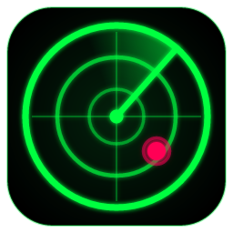
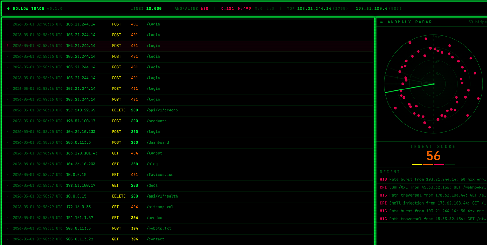

<p align="center">
  
</p>

<h1 align="center">Hollow Trace</h1>

<p align="center">A desktop forensics tool that scans server logs for attacks in real time.</p>

<p align="center">
  <a href="https://github.com/JoshBlazer/hollow-trace/actions/workflows/ci.yml"></a>
  <a href="https://github.com/JoshBlazer/hollow-trace/releases/latest"></a>
</p>

Open a log file or tail a live one, and Hollow Trace parses each line, flags anomalies, and shows them on a log stream, an anomaly radar, and a running threat score.



Built with Tauri 2: a Rust backend does all parsing and detection, and a React + TypeScript frontend displays the results.

## Features

- **Log formats.** The format is detected automatically from the first 20 lines.
  - Apache/Nginx combined access logs.
  - `auth.log`/syslog (RFC 3164).
  - JSON lines. Fields are read from common names such as `timestamp`/`time`/`@timestamp`, `message`/`msg`, `level`/`severity` and `ip`/`remote_addr`/`client_ip`.
- **Gzip.** Rotated logs such as `access.log.2.gz` open directly. Compression is detected from the file's content, not its name.
- **Open or tail.** Parse a whole file, or watch a file and process new lines as they're written.
  - A line that's still being written is held until it's complete.
  - If the log is truncated or rotated, tailing restarts from the top.
- **Detection:**

  | Detector | Flags | Severity |
  |---|---|---|
  | Pattern | SQL injection, shell injection, SSRF/XXE | Critical |
  | Pattern | Path traversal, XSS, known scanners (Nikto, sqlmap, nmap, …) | High |
  | Pattern | A single auth failure (`Failed password`, `Invalid user`, …) | Low |
  | Rate | Repeated failures from one IP: 4xx responses, or failed logins in `auth.log`. Default ≥ 50 within 10 s. One alert per burst. | High |
  | Baseline | Response size far from the running mean. Default 3σ, after 1,000 samples. | Medium |

  - Requests are URL-decoded before matching, so encoded payloads like `UNION+SELECT` or `%2e%2e%2f` are caught.
  - The rate and baseline thresholds and an IP allowlist are adjustable in [Detection settings](#detection-settings).

- **Threat score (0–100).** The score has two halves, each capped at 50:
  - the anomaly rate (the percentage of lines flagged);
  - a severity weighting: Critical × 20, High × 10, Medium × 5, Low × 1.
- **Search.** Filter the stream by text, IP or CIDR range, severity and HTTP status class. Searches cover the last 100,000 lines, not just the 10,000 on screen.
- **Jump to line.** Click any anomaly, in the radar's Recent list or the Anomalies tab, to see that line with 200 lines of context either side.
- **Anomalies view.** All anomalies grouped by source IP or attack type, with counts, worst severity and first/last seen. Expand a group to see its individual findings.
- **Export.**
  - Anomalies as CSV for spreadsheets, or JSON. Cells that a spreadsheet would run as formulas are neutralized, because log text is attacker-controlled.
  - A Markdown incident report: summary, top sources, attack types, timeline and critical findings. Attacker text is escaped, so it can't render as HTML or links when pasted into a ticket.
- **Works offline.** Fonts and assets are bundled. The only network request is the optional update check against this repo's GitHub Releases.
- **Auto-updates.** The app checks for a signed release once per launch and offers to install it.

## Getting started

### Install

Download the latest installer from [Releases](https://github.com/JoshBlazer/hollow-trace/releases/latest): the `-setup.exe` or the `.msi`.

The installers aren't code-signed yet, so Windows SmartScreen may warn on first run. Choose **More info → Run anyway**. Updates are still signature-checked; see [Releasing](#releasing).

### Build from source

**Prerequisites:**

- [Node.js](https://nodejs.org/) 20.19+ (required by Vite 7)
- [Rust](https://rustup.rs/) (stable)
- The [Tauri 2 prerequisites](https://tauri.app/start/prerequisites/) for your OS. On Windows, WebView2 is already included in Windows 11.

**Run in development:**

```sh
npm install
npm run tauri dev
```

The first build compiles the Rust dependencies and takes several minutes. Later builds are incremental.

**Build installers:**

```sh
npm run tauri build
```

Installers are written to `src-tauri/target/release/bundle/`. Release builds are much faster at runtime than `tauri dev`: parsing and detecting 10,000 lines takes about 80 ms.

The app icon's source is `app-icon.svg`. After editing it, regenerate every size with `npx tauri icon app-icon.svg`.

## Usage

Press **Ctrl+K** (⌘K on macOS) to open the command palette, then choose one of these commands. **Ctrl+O** (⌘O) opens a file directly, and **Ctrl+F** (⌘F) jumps to the search box.

| Command | What it does |
|---|---|
| Open File | Parse an existing log file (plain or `.gz`) from start to finish |
| Watch File | Tail a live log file for new entries |
| Export Anomalies | Save anomalies as CSV or JSON |
| Export Report | Save a Markdown incident report |
| Stop Watching | Detach the file watcher |
| Clear Stream | Flush the log buffer and reset stats |
| Detection Settings | Edit thresholds and the IP allowlist |

The main panel has two tabs:

- **Stream.** Click a row to see the raw line and parsed fields. A `!` marks an anomaly and is colored by severity. **PAUSE** stops auto-scrolling. Use the search bar to filter; the status line shows how many lines matched.
- **Anomalies.** Group by source IP or attack type. Click a column header to sort, click a group to expand it, and click a finding to jump to its line.

On the radar, a blip's distance from the center shows its severity: Critical on the outer ring, Low near the center. The **Recent** list shows the latest anomalies with their source IP and request.

Errors appear as notifications at the bottom of the window. Examples: a file can't be read, or a watched file disappears.

### Detection settings

| Setting | Default | Meaning |
|---|---|---|
| Rate threshold | 50 | Failures from one IP that trigger a burst alert |
| Rate window | 10 s | Time window for the threshold |
| Baseline sigma | 3 | Standard deviations from the mean response size before flagging |
| Allowlist | empty | IPs or CIDR ranges (IPv4 or IPv6) that are never flagged, such as your own scanners or office VPN |

Settings are saved to `%APPDATA%\dev.hollowtrace.desktop\settings.json` on Windows. They apply to the next Open File or Watch File.

### Logs

The app writes a rotating log file (5 × 5 MB) to `%LOCALAPPDATA%\dev.hollowtrace.desktop\logs\` on Windows. Include it when reporting a problem.

### Long-running tails

Memory stays bounded during a long Watch File:
- the newest 50,000 anomalies are kept for export;
- the backend buffer holds the last 100,000 entries;
- the log stream shows the last 10,000 entries;
- per-IP tracking drops IPs that have gone quiet.

Totals and severity counts still include everything.

## Security

- **Least privilege.** The webview has no file-system permissions; log files are read by the Rust backend. It can open the file dialogs, write to the app log, and check for and install updates.
- **No external content.** A strict Content Security Policy forbids remote scripts, styles, fonts and connections. Log content is always rendered as text, never as HTML.
- **Developer tools** are disabled in release builds.

## Test data

Two scripts generate an Apache access log with injected attacks: SQL injection, path traversal, shell injection, XSS, SSRF, scanner probes and brute-force bursts.

```sh
python generate_logs.py [output] [lines]       # default: test-apache.log, 10000
```

```powershell
.\generate_logs.ps1 -Output test-apache.log -Lines 10000
```

`*.log` files are gitignored.

## Tests

```sh
npm test                       # frontend (Vitest)
cd src-tauri && cargo test --lib   # backend
```

[CI](.github/workflows/ci.yml) runs the type-check, both test suites and a frontend build on every push and pull request.

## Releasing

1. Bump the version in `package.json`, `src-tauri/Cargo.toml` and `src-tauri/tauri.conf.json`.
2. Commit, then push a matching tag:

   ```sh
   git tag v0.2.0
   git push origin v0.2.0
   ```

3. The [release workflow](.github/workflows/release.yml):
   - checks that the tag matches the app version;
   - runs the tests;
   - builds the installers;
   - signs the update bundles;
   - creates a **draft** GitHub Release with the installers and `latest.json`.
4. Review the draft and publish it. Installed copies will offer the update on their next launch.

**Update signing.** Updates are verified against the public key in `tauri.conf.json`.
- The matching private key is stored in two places: the `TAURI_SIGNING_PRIVATE_KEY` Actions secret, and `~/.tauri/hollow-trace.key` on the maintainer's machine.
- **Back up that key file somewhere safe.** If it's lost, existing installs can't receive updates and must be reinstalled manually.
- To sign updates locally, set `TAURI_SIGNING_PRIVATE_KEY` to the key file's path and build with `--config src-tauri/tauri.release.conf.json`.

### Code signing

The installers aren't code-signed yet; this is separate from update signing. The build is already prepared for it in `bundle.windows`, with a SHA-256 digest and a DigiCert timestamp server. To enable it:

1. Get a code-signing certificate, or set up [Azure Trusted Signing](https://learn.microsoft.com/azure/trusted-signing/).
2. **Local certificate:** install it in the Windows certificate store, then set `bundle.windows.certificateThumbprint` to its thumbprint.
3. **Azure Trusted Signing or a cloud HSM:** set `bundle.windows.signCommand` instead. See [Tauri's Windows signing guide](https://v2.tauri.app/distribute/sign/windows/).
4. **In CI:** import the certificate in the release workflow before the `tauri-action` step.

## Project layout

```
src/                  React frontend
  hooks/              Tauri event subscriptions, log buffer, auto-scroll
  components/         log-stream, sonar (radar), stats, command-palette, settings, toasts
  types/hollow.ts     Shared types (mirror of the Rust structs)
  lib/                Typed invoke() wrappers, notifications, updater, formatting
src-tauri/src/
  parser/             Apache, auth.log, JSON parsers (pure functions)
  detector/           Pattern, rate and baseline detectors
  watcher/            File load and live tail (dedicated OS thread)
  settings.rs         Detection settings and IP/CIDR allowlist
  events.rs           Batched events to the frontend
  scorer.rs           Threat score
```

See [`CLAUDE.md`](CLAUDE.md) for the project's conventions and key design decisions.

## Known issues

- `npm audit` reports 5 high-severity findings in `braces`, which Tailwind CSS v3's file watcher depends on. No patched `braces` release exists, and npm's only fix is upgrading to Tailwind v4, which this project doesn't use. The exposure is build-time only: nothing from this dependency ships in the app.
- Detection only sees what the log records. Request bodies (e.g. POSTed SQL injection) aren't in access logs.
